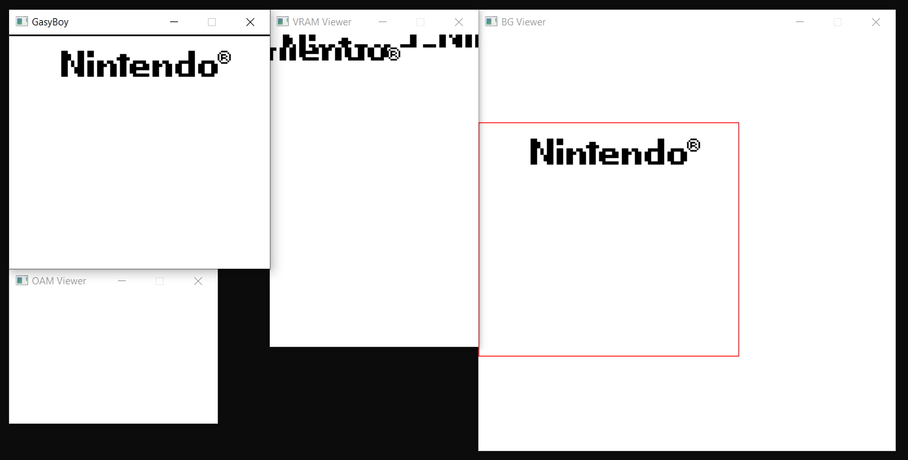
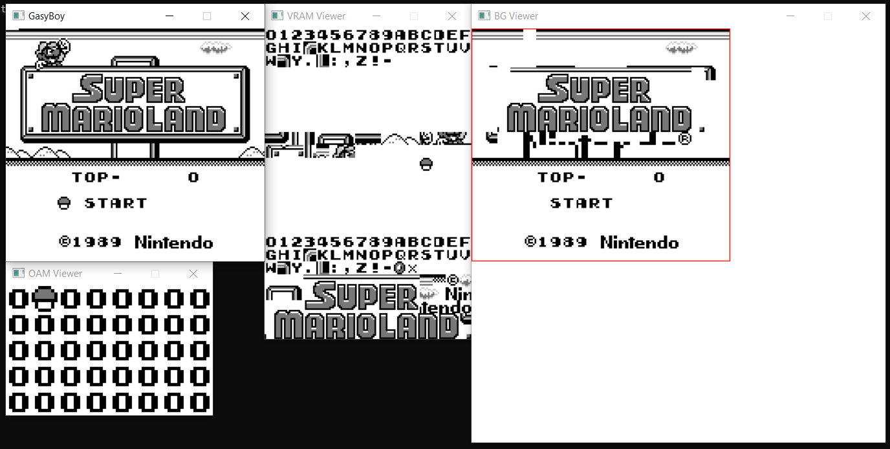
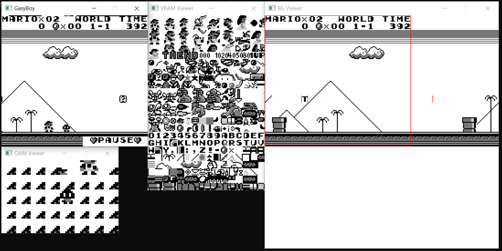
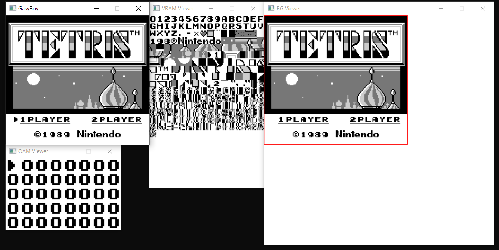
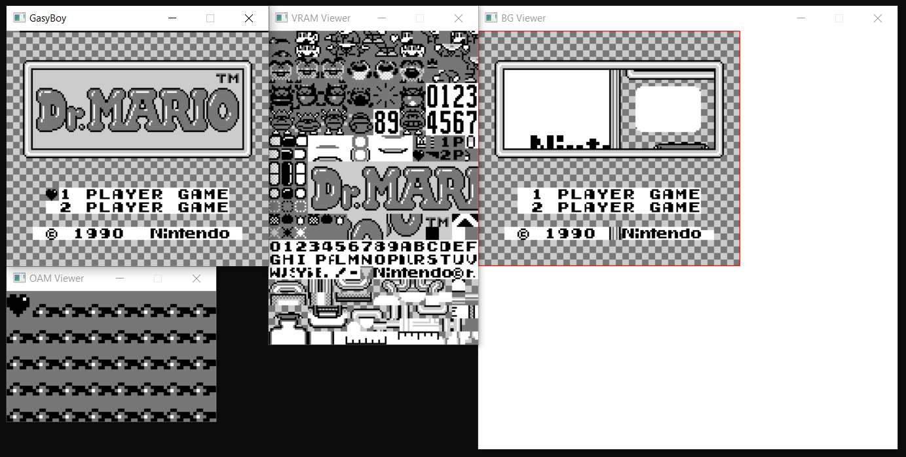
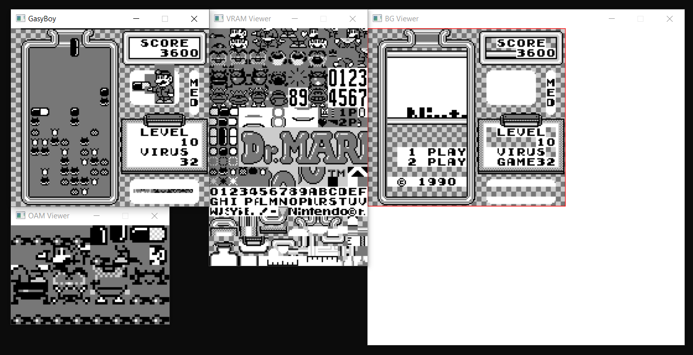

# 🕹️ **GasyBoy** 🕹️
**Gameboy** emulator made with **C++/SDL2**.

###### ⬜⬜⬜⬜⬜⬜⬜⬜
###### ⬜🌫️🌫️🌫️🌫️🌫️🌫️⬜
###### ⬜🌫️🟩🟩🟩🟩🌫️⬜
###### ⬜🌫️🟩🟩🟩🟩🌫️⬜
###### ⬜🌫️🟩🟩🟩🟩🌫️⬜
###### ⬜🌫️🟩🟩🟩🟩🌫️⬜
###### ⬜🌫️🌫️🌫️🌫️🌫️🌫️⬜
###### ⬜⬜⬜⬜⬜⬜⬜⬜
###### ⬜⬜⬛⬜⬜⬜🔴⬜
###### ⬜⬛⬛⬛⬜🔴⬜⬜
###### ⬜⬜⬛⬜⬜⬜⬜⬜
###### ⬜⬜⬜⬜⬜⬜⬜⬜
###### ⬜⬜⬜⬜⬜⬜⬜⬜
###### ⬜⬜⬜⬜⬜⬜⬜⬜

-----

## 🔥 **Features**
- [x] Fully working **Zilog Z80 CPU** with all opcodes
- [x] Working NoMBC and MBC1 roms (MBC1 may cause visual bugs)
- [x] Working buttons

## ⛔ **About ROM and illegal stuff**

**All stuff related to Nintendo belongs to Nintendo**. I don't support piracy so **FIND ROMS ON YOUR OWN**. Or for tesing purpose, use test roms available [here](https://github.com/c-sp/gameboy-test-roms/) (roms are in .gb extension).

## 🛠️ **Building**

 - ### **Requirements**
    - **Visual Studio** (any version from VS15 will work)
    - SDL2 (already included)

 - ### **Build**
    Just build the solution of the project

## 📸 **Screenshots** 📸

1) **<u>Nintendo Boot Logo</u>**

2) **<u>Super Mario Land</u>**

<table>
    <tr>
        <td>
            
        </td>
        <td>
            
        </td>
    </tr>
</table>

3) **<u>Tetris</u>**

<table>
    <tr>
        <td>
            
        </td>
        <td>
            
        </td>
    </tr>
</table>

4) **<u>Super Mario Land</u>**

<table>
    <tr>
        <td>
            
        </td>
        <td>
            
        </td>
    </tr>
</table>

## 📝 **TODO:**
- [ ] Fix PPU sprites transparency bug
- [ ] Add supprt for more MBCs memory support
- [ ] Add savestates
- [ ] Make better UI and window
