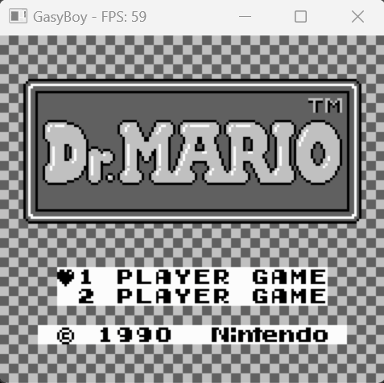
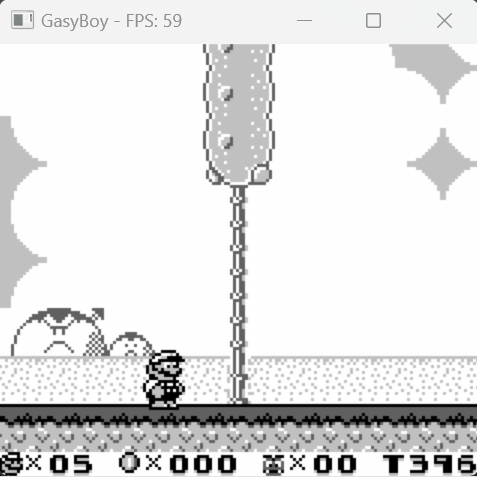

# 🕹️ GasyBoy 🕹️
**Gameboy Emulator in C++/SDL2**

GasyBoy is a high-performance Gameboy emulator built with modern C++ and SDL2. It delivers an authentic emulation experience while providing a comprehensive, user-friendly debugging suite.

---

## 🚀 Live Demo
Experience GasyBoy directly in your web browser:  
[Visit the GasyBoy Live Demo](https://tsilaallaoui.github.io/GasyBoy/index.html)

---

### Gameplay Highlights

<table>
  <tr>
    <td align="center"></td>
    <td align="center"></td>
    <td align="center"></td>
  </tr>
  <tr>
    <td align="center"></td>
    <td align="center"></td>
    <td align="center"></td>
  </tr>
</table>

[**Try the Live Demo!**](https://tsilaallaoui.github.io/GasyBoy/index.html)

## 🎮 Features

- **Zilog Z80 CPU:** Fully implemented with all opcodes.
- **ROM Support:** Compatible with ROM Only, MBC1, MBC2, MBC3, and MBC5 titles.
- **Comprehensive Debugger:** Easy to use for inspecting and managing emulator state.
- **Smooth Performance:** Consistent 60 FPS performance, even in debug mode.

---

## ⚠️ Legal Notice

All properties and trademarks related to Nintendo belong to Nintendo. **GasyBoy is for educational and testing purposes only.** Please use ROMs legally obtained or use test ROMs available [here](https://github.com/retrio/gb-test-roms) (files in .gb format).

---

## 🛠️ Building GasyBoy

### Requirements

- **CMake:** Version 3.10 or higher.
- **Compiler:**  
  - **Windows:** MSVC Toolchains (supporting C++20)  
  - **Linux:** GCC/G++ (supporting C++20)  
  - **Web:** Emscripten (for building and running WASM in a browser)

### Build Instructions

1. Run the appropriate script in the `./tools` directory based on your OS.
2. For building the WASM version, run the corresponding script in `./tools/*your_os*/build_wasm.(sh|bat)`.

---

## 📝 TODO

- [ ] **Savestates:** Add save and load functionality.
- [ ] **RTC Support:** Implement real-time clock features.
- [ ] **Link Cable / Online Play:** Enable multiplayer connectivity.
- [ ] **Enhanced Debugger UI:** Improve the user interface of the debugger.
- [ ] **Platform Porting:** Expand compatibility with additional devices.

---

Enjoy exploring and enhancing GasyBoy! Contributions and feedback are always welcome.
